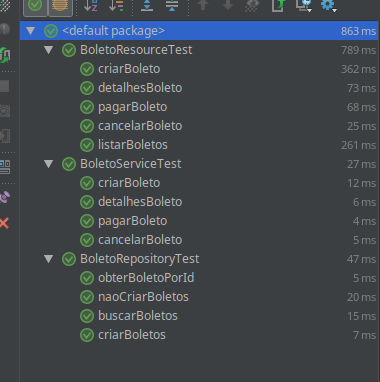
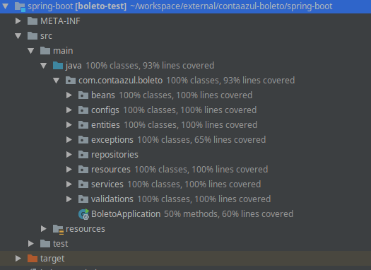

<h1 id="api-boleto-contaazul">API Boleto ContaAzul</h1>

O objetivo do desafio é construir uma API REST para geração de boletos que será consumido por um módulo de um sistema de gestão financeira de microempresas. 
Desafio foi proposto pela <strong>Pamêlla Hess</strong> da empresa <a href="https://contaazul.com/">ContaAzul.com</a> tendo como documento com as especificações: <a href="https://drive.google.com/file/d/1DvjRBTvnHwlUOoNBwAsvoRF6aKqYm7pP/view">aqui</a>

<h2 id="executando">Executando</h2>
<h5 id="para-fazer-install-das-libs">Para fazer install das LIBs</h5>
<pre><code>mvn clean install -f pom.xml 
</code></pre>
<h5 id="executando-a-aplicação">Executando a aplicação</h5>
<pre><code>mvn spring-boot:run
</code></pre>
<h5 id="executando-a-aplicação">Executando teste de avaliação com SonarCube</h5>
<pre>
<code>mvn sonar: sonar \
  -Dsonar.projectKey = contaazul \
  -Dsonar.organization = cafecanudo-github \
  -Dsonar.host.url = https: //sonarcloud.io \
  -Dsonar.login = ccdb1d261679f21e9ab3cdb3724ef3f05c45f29e
</code>
</pre>
<h2 id="interface-de-testedocumentação">Interface de Teste/Documentação</h2>

Documentacao da API <a href="http://localhost:8080/rest/swagger-ui.html">http://localhost:8080/rest/swagger-ui.html</a>

<h2 id="coverage">Coverage</h2>
<h2 id="observações-e-melhorias-sobre-a-documentaçãoregras">Observações e melhorias sobre a documentação(Regras)</h2>

  

<ul>
<li>Não esta na documentação, porém, a implementação permite somente que boletos PENDING possam ser calculados os juros.</li>
<li>Seria importante salvar o valor pago pelo BOLETO no momento que alterar seu STATUS para PAID, sem isso não será possível recuperar essa informação.</li>
<li>Não ficou claro se é permitido cancelar o boleto mesmo depois de pago. Cancelado é cancelado, não é estornado.</li>
<li>No momento de ver os detalhes do boleto tem um coluna FINE, não existe no documento seu objetivo.</li>
</ul>
<h2 id="tecnologias">Tecnologias</h2>

              

